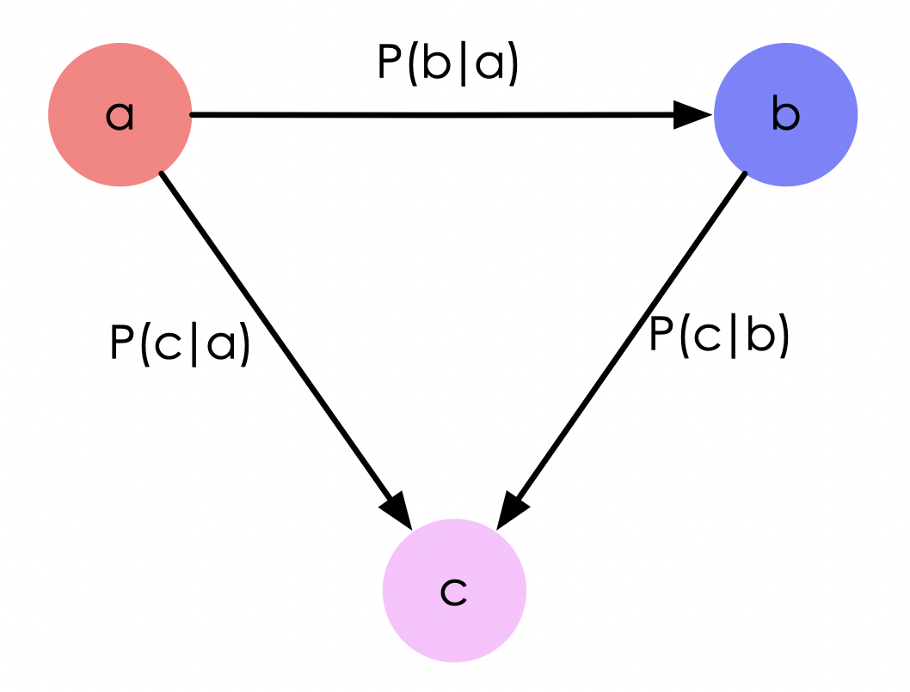

# 贝叶斯网络（Bayesian Network）

本文介绍包含了贝叶斯思考模式，贝叶斯方法，贝叶斯网络等。

## 贝叶斯方法

### 频率学派与贝叶斯学派

当前针对**统计推断**的主张与想法，大体存在两个流派：

- **频率学派**：特征是把需要推断的概率参数$\theta$视作**固定但未知的常数**，而样本$X$是随机的，重点是研究**样本空间**（需要不断做实验，概率计算都是针对样本的分布）。即可理解为：频率学派为事件本身建模，其认为数据都是在服从某个固定的参数值下产生的，需要做的就是不停的抽样来找到这个值，如事件A在独立重复试验中发生的频率趋于极限p，那么这个极限就是该事件的概率。

- **贝叶斯学派**：特征是把$\theta$视作**随机变量**，而样本$X$是固定的，重点研究**参数空间**（每做一次实验，都修正先验参数），操作模式是通过参数的先验分布结合样本信息得到参数的后验分布。即可理解为：贝叶斯学派并不刻画事件本身，而是从观察者角度出发，因为观察者知识不完备，故可认为参数空间的每一个值都可能是真实模型使用的值，只是概率不同，我们就需要结合实验来逐渐修正每个参数是真实模型参数值的概率，其思考模式可总结为：

  > 先验分布$\pi(\theta)$ + 样本信息$x$ => 后验分布$\pi(\theta|x)$，而使$\pi(\theta|x)$达到最大的值$ \theta$称为最大后验估计，类似于经典统计学中的极大似然估计。

贝叶斯想法更自然，而它的产生也远早于频率学派。因为贝叶斯学派需要找先验，不好操作，所以发展一直不好，而频率学派主要使用最优化的方法，在很多时候处理起来要方便很多。直到上世纪90年代依靠电子计算机的迅速发展，以及抽样算法的进步（Metropolis-hastings, Gibbs sampling）使得对于任何模型任何先验分布都可以有效地求出后验分布，贝叶斯学派才重新回到人们的视线当中。就现在而言，贝叶斯学派日益受到重视当然是有诸多原因的，但这并不意味这频率学派就不好或者不对。两个学派除了在**参数空间的认知**上有区别以外，方法论上都是互相借鉴也可以相互转化的。

### 贝叶斯定理

贝叶斯除了提出上述思考模式之外，还特别提出了举世闻名的[贝叶斯定理](../basics/probability_theory.ipynb)。

## 贝叶斯网络

贝叶斯网络(Bayesian network)，又称信念网络(Belief Network)，是一种概率图模型，于1985年由Judea Pearl首先提出。它是一种模拟人类推理过程中因果关系的不确定性处理模型，其网络拓朴结构是一个有向无环图DAG(directed acyclic graphical model)。

图中的节点表示随机变量：$\{X_1, X_2, ...,X_n\}$，它们可以是可观察到的变量，隐变量或未知参数等。如果两个随机变量之间存在因果关系（或称非条件独立），则会建立一条有向连接，连接线上有一个值代表条件概率。总结来说，把某个研究系统中涉及的随机变量，根据是否条件独立绘制在一个有向图中，就形成了贝叶斯网络，如下是一个简单的贝叶斯网络：

整张图可表示为$G=(I, E)$，其中$I$表示了所有节点的集合，$E$表示所有连接线的集合。节点$i$表示的随机变量可表示为$x_i$，所有节点的联合概率为：$p(X)=\sum_{i\in I}p(x_i|x_{pa(i)})$，上图中$p(a, b, c)=p(c|a,b)p(b|a)p(a)$。

## 参考文献

- [非常全面的贝叶斯网络介绍](https://www.cnblogs.com/princessd8251/articles/7569541.html)
- [机器学习 —— 概率图模型（贝叶斯网络）](https://www.cnblogs.com/ironstark/p/5087081.html)
- [知乎：从贝叶斯方法谈到贝叶斯网络](https://zhuanlan.zhihu.com/p/41069540)