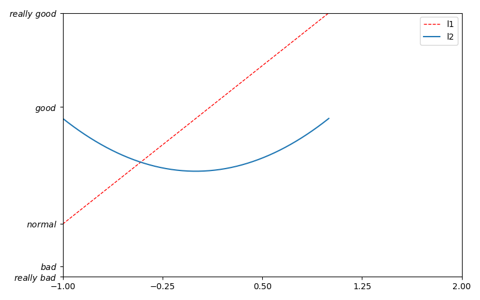
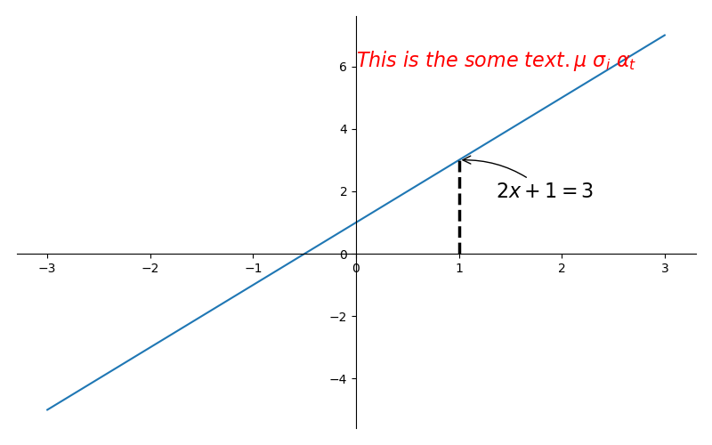
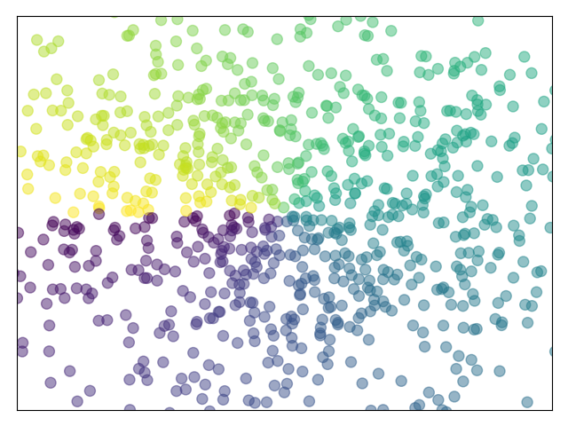
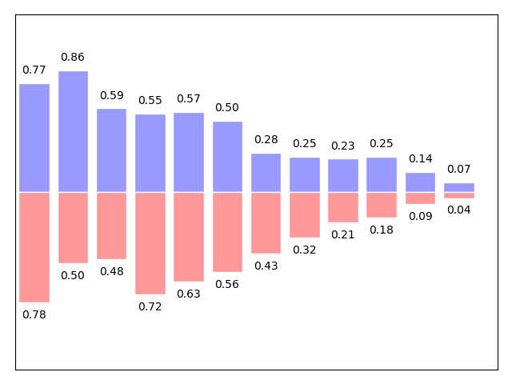
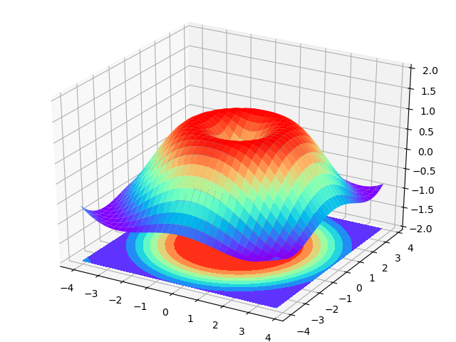
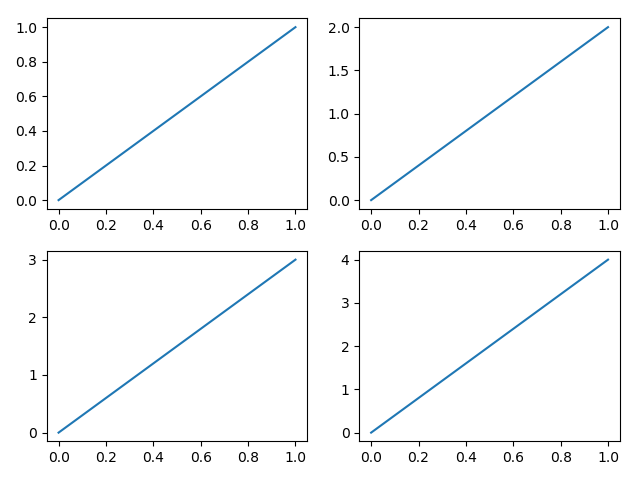
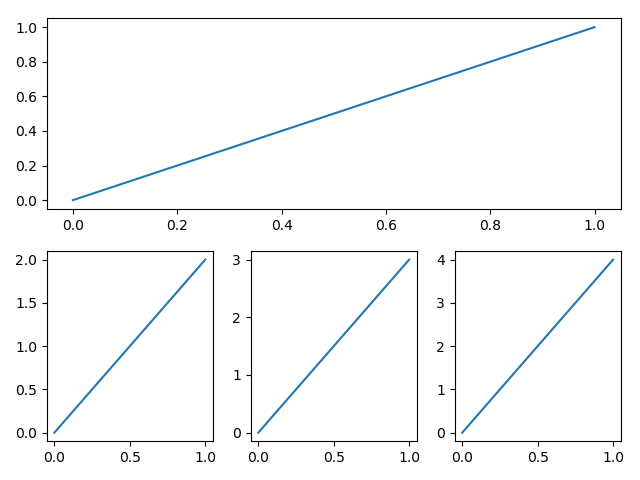

# Matplotlib

## Overview

Matplotlib可以画出以下:

- 线图;
- 散点图;
- 等高线图;
- 条形图;
- 柱状图;
- 3D 图形,
- 甚至是图形动画等等;

## Examples

- Simple example to use: [start](./start.py)
- How to use figure: [figure](./figure.py)
- Control coordinate axis: [coordinate_axis1](./coordinate_axis1.py), [coordinate_axis2](./coordinate_axis2.py)  
- set legend(图例, 帮我们展示出每个数据对应的图像名称): [legend](./legend.py)  

- add annotation(图线中某些特殊地方需要标注时): [annotation](./annotation.py)  

- scatter(散点图): [scatter](./scatter.py)  

- bar(柱状图): [bar](./bar.py)  

- 3d: [3d](./3d.py)

- subplot: [subplot](./subplot.py)

- animation: [animation](./animation.py)